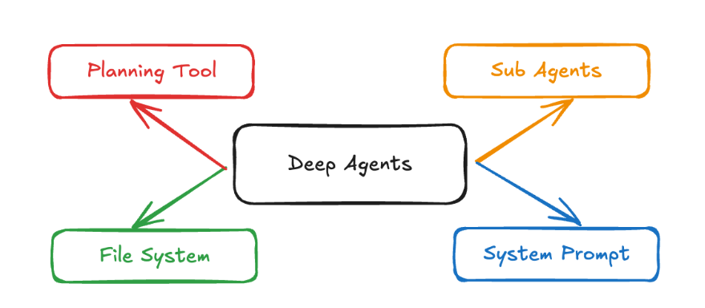

# LangChain 生态组件关系

| 平台组件   | 角色定位                     | 侧重场景与特点                                                                 |
|------------|------------------------------|------------------------------------------------------------------------------|
| **LangGraph** | 智能体运行时（Agent Runtime） | 提供底层执行框架，将代理逻辑表示为有状态图，便于编排复杂工作流。适合需要构建多步骤流程或多代理协同的场景。 |
| **LangChain** | 智能体开发框架（Agent Framework） | 提供核心的Agent循环机制和工具接口，让开发者可以从零搭建代理。适合需要自定义提示词、自定义工具的灵活开发，对应低层构建。 |
| **DeepAgents** | 智能体工具套件（Agent Harness） | 在 LangChain 基础上预设了一系列高级能力（规划、文件系统、记忆等）。适合希望快速构建更自主、长时运行的深度代理，将内置组件直接复用以专注于业务逻辑。 |

**DeepAgents** 引入的四大核心机制：
- 红色代表“规划工具”（Todo 清单）；
- 绿色代表“文件系统”（虚拟磁盘）；
- 橙色代表“子代理”（子任务智能体）；
- 蓝色代表“详细系统提示”。
  这些组件共同赋能代理处理长时序、复杂多步骤的任务，其核心架构组成如图所示：

**库**
- 环境管理：dotenv 用于加载 .env 文件中的环境变量
- 搜索能力：TavilyClient 提供互联网搜索功能
- 智能体框架：deepagents 和 langchain 构建智能体核心
- 美化输出：rich 库让终端输出更加友好（可选）