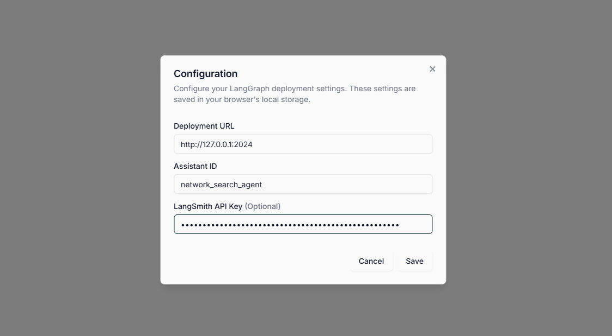

除了 LangGraph Studio，我们还可以将 LangGraph 服务器连接到专为 deepagents 设计的 UI ：https://github.com/langchain-ai/deep-agents-ui
- Step 1. 克隆 Deep Agents UI 仓库
    ```
    git clone https://github.com/langchain-ai/deep-agents-ui.git
    cd deep-agents-ui
    ```
- Step 2. 安装依赖
  执行如下代码安装依赖：
    ```
    npm install
    ```
- Step 3. 启动 UI
  执行如下代码启动 UI：
    ```
    npm run dev
    ```
- Step 4. 连接到 LangGraph Server
