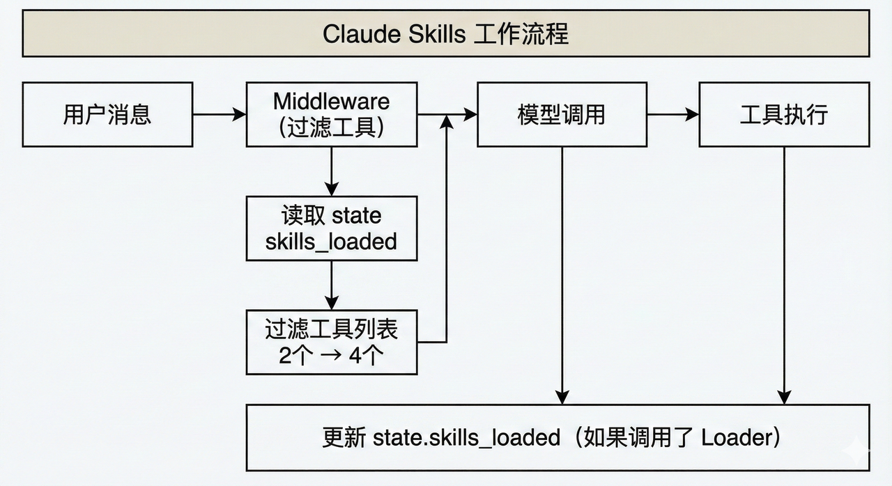
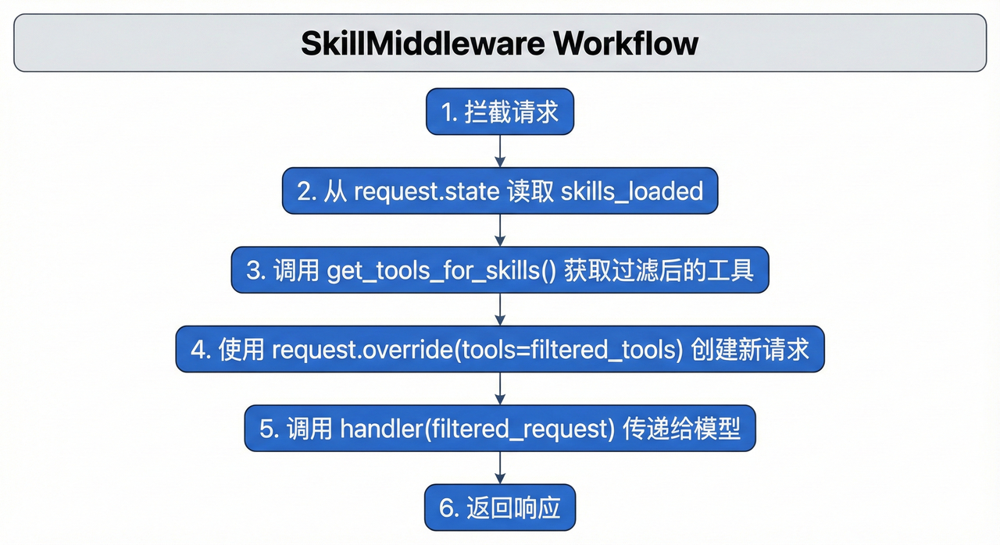

 Claude Code 的核心竞争力在于其“全栈意识”。它不仅仅关注当前打开的文件，而是能够通过索引和检索机制理解整个代码库的架构、依赖关系以及业务逻辑 。这种能力使得开发者可以从繁琐的语法细节中解脱出来，转向更高层次的架构设计和意图表达，这种工作流在社区中被形象地称为“氛围编程”（Vibe Coding）
 在 Claude Code 的架构中，Skill（技能） 扮演着至关重要的角色。如果说 Claude 模型是大脑，MCP 是连接外部世界的手脚，那么 Skill 就是存储特定领域专业知识的操作手册。
 Skill 通过引入动态加载（Dynamic Loading）和渐进式披露（Progressive Disclosure） 机制，优雅地解决了这一难题。它允许开发者将海量的程序性知识（Procedural Knowledge）封装在本地文件系统中，Agent 仅在识别到用户意图与某个 Skill 匹配时，才会按需加载相关的指令和脚本 。这种架构不仅极大地扩展了 Agent 的能力边界，还保证了推理的高效性和准确性。
  LangChain 1.1 版本最大的优势就是在LangGraph之上构建并集成了革命性的 Middleware API。
  这个 Middleware API 允许我们在 Agent 的执行流程中插入自定义逻辑，实现：
- 动态工具过滤：在每次模型调用前修改工具列表
- 状态管理：通过 state_schema 追踪运行时状态
- 请求拦截：使用 request.override() 修改请求参数

3 从零复现 Claude Skills 动态工具过滤
3.1 LangChain 1.1 本地运行与配置
  首先，让我们导入实现 Claude Skills 所需的核心库。这里我们会用到 LangChain 1.1 的几个关键模块：
- langchain.agents：提供 create_agent 和 Middleware 相关类
- langchain_core.tools：工具定义的基类
- typing_extensions：用于定义状态 Schema 的 TypedDict
  执行如下代码：
    ```
    %pip install -U langchain langgraph langchain-openai pdfplumber pandas numpy matplotlib python-dotenv

    ! pip show langchain
    ```
3.2 配置 DeepSeek-v3.2 模型
    这里我们使用的是最新发布的 DeepSeek-v3.2 推理模型。但需要说明的是：因为 DeepSeek-v3.2 模型刚刚发布，其推理模式在langChian 1.1的新版本中存在兼容性问题，在进行工具调用过程中会报错.因此，我们团队也是完全重写了 DeepSeek-v3.2-reasoner 的模型适配器
    DeepSeekReasonerChatModel 是我们自定义的模型适配器，它继承自 LangChain 的 BaseChatModel，并添加了对 DeepSeek 推理模型的支持。关键特性是它会保留模型返回的 reasoning_content（推理过程），这对于调试和理解模型行为非常有帮助。
3.3 配置LangChain1.1 Middleware
  中间件（Middleware）是一个非常常见的设计模式。它允许你在请求处理的过程中插入自定义逻辑，而不需要修改核心代码。
  LangChain 1.1 引入的 Agent Middleware 遵循同样的理念：
    请求 ──▶ [中间件1] ──▶ [中间件2] ──▶ ... ──▶ [核心处理] ──▶ 响应
                │              │
                ▼              ▼
            可以修改请求    可以修改请求
  在 Agent 的上下文中，Middleware 可以：
1. 拦截模型调用请求：在模型被调用之前获取请求信息
2. 修改请求参数：比如修改工具列表、系统提示等
3. 传递给下一个处理器：调用 handler(request) 继续执行
4. 处理响应：可以在返回之前修改响应（可选）
  这正是实现动态工具过滤的关键！我们可以在 Middleware 中检查当前状态，然后只把相关的工具传递给模型。
  ModelRequest 是 Middleware 中最重要的对象，它封装了模型调用的所有信息：
    class ModelRequest:
        messages: List[BaseMessage]  # 消息历史
        tools: List[BaseTool]        # 可用工具列表
        state: Dict[str, Any]        # 当前状态（关键！）
        
        def override(self, **kwargs) -> ModelRequest:
            """创建一个修改了指定参数的新 Request"""
            # 返回新的 ModelRequest，保持不可变性
  request.override() 是实现动态过滤的核心方法。它允许我们创建一个新的请求对象，其中某些参数被修改了，而其他参数保持不变。例如：
    # 只修改工具列表，其他参数保持不变
    filtered_request = request.override(tools=filtered_tools)
3.5 定义工具与状态 Schema
  在 LangChain 1.1 中，State Schema 用于定义 Agent 运行时需要追踪的状态信息。它使用 Python 的 TypedDict 来定义，提供类型安全和清晰的结构。
  对于 Claude Skills，我们需要追踪一个关键状态：skills_loaded - 当前已加载的技能列表。这个状态会被 Middleware 读取，用于决定哪些工具应该暴露给模型
3.6 定义外部工具
  现在，我们需要定义一组示例工具来实际展示动态过滤流程。我们会创建三类工具：
1. Loader 工具（始终可见）：用于加载技能；
2. 数据分析工具：只有加载了 data_analysis 技能后才可见；
3. 文本处理工具：只有加载了 text_processing 技能后才可见；
3.7 定义工具映射
  为了实现动态过滤，我们需要定义一个映射关系：哪些工具属于哪个技能。
3.8 实现 SkillMiddleware（核心）
  现在我们来实现整个系统的核心组件：SkillMiddleware。它的工作流程如下：
